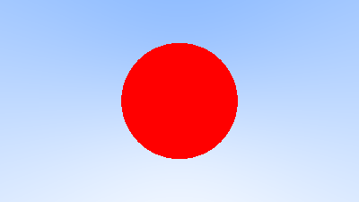

# Adding a Sphere

Let’s add a single object to our ray tracer. People often use spheres in ray tracers because calculating whether a ray hits a sphere is pretty straightforward.

## Ray-Sphere Intersection

Recall that the equation for a sphere centered at the origin of radius \\(\textbf{R}\\) is
$$ \textit{x}^2 + \textit{y}^2 + \textit{z}^2 = \textbf{R}^2 $$
 Put another way, if a given point \\((\textit{x},\textit{y},\textit{z})\\) is \\(\textit{inside}\\) the sphere, then
 $$ \textit{x}^2 + \textit{y}^2 + \textit{z}^2 < \textbf{R}^2 $$
 , and if a given point \\(\textit{x}, \textit{y}, \textit{z}\\) is outside the sphere, then
 $$ \textit{x}^2 + \textit{y}^2 + \textit{z}^2 > \textbf{R}^2 $$

It gets uglier if the sphere center is at \\((C_x,C_y, C_z )\\):
$$ (x-C_x)^2 + (y-C_y)^2 + (z-C_z)^2 = r^2 $$

In graphics, you almost want your formulas to be in terms of vectors so all the \\(x/y/z\\) stuff is under the hood in the **vec3** class. You might note that the vector from center \\(\textbf{C} = (C_x, C_y, C_z)\\) to point \\(\textbf{P} = (x,y,z)\\) is \\((\textbf{P}-\textbf{C})\\), and therefore

$$ (\textbf{P}-\textbf{C}) \cdot (\textbf{P}-\textbf{C}) = (x-C_x)^2 + (y-C_y)^2 + (z-C_z)^2 $$

So the equation of the sphere in vector form is:
$$ (\textbf{P} - \textbf{C}) \cdot (\textbf{P} - \textbf{C}) = r^2 $$

We can read this as "any point \\(\textbf{P}\\) that satisfies this equation is on the sphere". We want to know if our ray \\(\textbf{P}(t)=\textbf{A}+t\textbf{b}\\) ever hits the sphere anywere. If it does hit the sphere, there is some \\(t\\) for which \\(\textbf{P}(t)\\) satisfies the sphere equation. So we are looking for any \\(t\\) where this is true:
$$ (\textbf{P}(t)-\textbf{C})\cdot(\textbf{P}(t)-\textbf{C}) = r^2 $$

or expanding the full form of the ray \\(\textbf{P}(t)\\):
$$ (\textbf{A}+t\textbf{b}-\textbf{C})\cdot(\textbf{A}+t\textbf{b}-\textbf{C})=r^2 $$

The rules of vector algebra are all that we would want here. If we expand that equation and move all the terms to the left hand side we get:
$$ t^2\textbf{b}\cdot\textbf{b} + 2t\textbf{b}\cdot(\textbf{A}-\textbf{C})+(\textbf{A}-\textbf{C})\cdot(\textbf{A}-\textbf{C})-r^2=0 $$

The vectors and \\(r\\) in that equation are all constant and known. The unknown is \\(t\\), and the equation is a quadratic, like you probably saw in your high school math class. You can solve for \\(t\\) and there is a square root part that is either positive (meaning two real solutions), negative (meaning no real solutions), or zero (meaning one real solution). In graphics, the algebra almost always relates very directly to the geometry. What we have is:


## Creating Our First Raytraced Image

If we take that math and hard-code it into our program, we can test it by coloring red any pixel that hits a small sphere we place at −1 on the z-axis:

```rust
fn hit_sphere(center: &Point3, radius: f64, r: &Ray) -> bool {
    let oc: Vec3 = r.origin() - *center;
    let a = Vec3::dot(&r.direction(), &r.direction());
    let b = 2.0 * Vec3::dot(&oc, &r.direction());
    let c = Vec3::dot(&oc, &oc) - radius * radius;
    (b * b - 4.0 * a * c) > 0f64
}

fn ray_color(r: &Ray) -> Color {
    if hit_sphere(&Point3::from(0f64, 0f64, -1f64), 0.5, r) {
        return Color::from(1f64, 0f64, 0f64);
    }
    let unit_direction: Vec3 = r.direction().unit_vector();
    let t = 0.5 * (unit_direction.y() + 1f64);
    (1f64 - t) * Color::from(1f64, 1f64, 1f64) + t * Color::from(0.5, 0.7, 1f64)
}
```

What we get is this:



Now this lacks all sorts of things — like shading and reflection rays and more than one object — but we are closer to halfway done than we are to our start! One thing to be aware of is that we tested whether the ray hits the sphere at all, but \\(t<0\\) solutions work fine. If you change your sphere center to \\(z=+1\\) you will get exactly the same picture because you see the things behind you. This is not a feature! We’ll fix those issues next.
