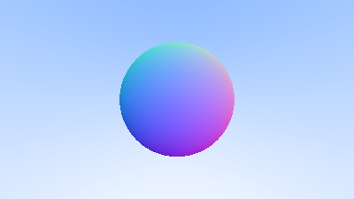

# Surface Normals and Multiple Objects

## Shading with Surface Normals

First, let’s get ourselves a surface normal so we can shade. This is a vector that is perpendicular to the surface at the point of intersection. There are two design decisions to make for normals. The first is whether these normals are unit length. That is convenient for shading so I will say yes, but I won’t enforce that in the code. This could allow subtle bugs, so be aware this is personal preference as are most design decisions like that. For a sphere, the outward normal is in the direction of the hit point minus the center:


On the earth, this implies that the vecor form the earth's center to you points straight up. Let's throw that into the code now, and shade it. We don't have any lights or anything yet, so let's just visualize the normals with a color map. A common trick used for visual normals (because it's easy and somewhat intuitive to assume \\(\textbf{n}\\) is a unit length vector -- so each component is between -1 and 1) is to map each component to the interval from 0 to 1, and then map x/y/z to r/g/b. For the normal, we need the hit point, not just whether we hit or not. We only have one sphere in the scene, and it's directly in front of the camera, so we won't worry about negative values of \\(t\\) yet. We'll just assume the closest hit point (smallest \\(t\\)). These changes in the code let us compute and visualize \\(\textbf{n}\\):

```rust

fn hit_sphere(center: &Point3, radius: f64, r: &Ray) -> f64 {
    let oc: Vec3 = r.origin() - *center;
    let a = Vec3::dot(&r.direction(), &r.direction());
    let b = 2.0 * Vec3::dot(&oc, &r.direction());
    let c = Vec3::dot(&oc, &oc) - radius * radius;
    let discriminant = b * b - 4.0 * a * c;
    if discriminant < 0.0 {
        -1.0
    } else {
        (-b - discriminant.sqrt()) / (2.0 * a)
    }
}

fn ray_color(r: &Ray) -> Color {
    let t = hit_sphere(&Point3::from(0f64, 0f64, -1f64), 0.5, r);
    if t > 0.0 {
        let n = Vec3::unit_vector(&(r.at(t) - Vec3::from(0.0, 0.0, -1.0)));
        return 0.5 * Color::from(n.x() + 1.0, n.y() + 1.0, n.z() + 1.0);
    }
    let unit_direction: Vec3 = r.direction().unit_vector();
    let t = 0.5 * (unit_direction.y() + 1f64);
    (1f64 - t) * Color::from(1f64, 1f64, 1f64) + t * Color::from(0.5, 0.7, 1f64)
}
```
And that yields this picture:



## Simplifying the Ray-Sphere Intersection Code

Let's revisit the ray-sphere equation:

```rust
fn hit_sphere(center: &Point3, radius: f64, r: &Ray) -> f64 {
    let oc: Vec3 = r.origin() - *center;
    let a = Vec3::dot(&r.direction(), &r.direction());
    let b = 2.0 * Vec3::dot(&oc, &r.direction());
    let c = Vec3::dot(&oc, &oc) - radius * radius;
    let discriminant = b * b - 4.0 * a * c;
    if discriminant < 0.0 {
        -1.0
    } else {
        (-b - discriminant.sqrt()) / (2.0 * a)
    }
}
```

First recall that a vector dotted with itself is equal to the squared length of that vector.

Second, notice how the equation for **b** has a factor of two in it. Consider what happens to the quardratic equation if \\(b=2h\\):

$$
\frac{-b\pm\sqrt{b^2-4ac}}{2a} \\\\
= \frac{-2h\pm\sqrt{(2h)^2-4ac}}{2a} \\\\
= \frac{-2h\pm2\sqrt{h^2-ac}}{2a} \\\\
= \frac{-h\pm\sqrt{h^2-ac}}{a}
$$

Using these observations, we can now simplify the sphere-intersection code to this:

```rust
fn hit_sphere(center: &Point3, radius: f64, r: &Ray) -> f64 {
    let oc: Vec3 = r.origin() - *center;
    let a = r.direction().length_squared();
    let half_b = Vec3::dot(&oc, &r.direction());
    let c = oc.length_squared() - radius * radius;
    let discriminant = half_b * half_b - a * c;
    if discriminant < 0.0 {
        -1.0
    } else {
        (-half_b - discriminant.sqrt()) / a
    }
}
```

## An Abstraction for Hittable Objects

Now, how about several spheres? While it is tempting to have an array of spheres, a very clean solution is the make an “abstract class” for anything a ray might hit, and make both a sphere and a list of spheres just something you can hit. What that class should be called is something of a quandary —- calling it an “object” would be good if not for “object oriented” programming. “Surface” is often used, with the weakness being maybe we will want volumes. “hittable” emphasizes the member function that unites them. I don’t love any of these, but I will go with “hittable”.

This **hittable** abstract class will have a hit function that takes in a ray. Most ray tracers have found it convenient to add a valid interval for hits \\(t_{min}\\) to \\(t_{max}\\), so the hit only “counts” if \\(t_{min}<t<t_{max}\\). For the initial rays this is positive \\(t\\), but as we will see, it can help some details in the code to have an interval \\(t_{min}\\) to \\(t_{max}\\). One design question is whether to do things like compute the normal if we hit something. We might end up hitting something closer as we do our search, and we will only need the normal of the closest thing. I will go with the simple solution and compute a bundle of stuff I will store in some structure. Here’s the abstract class:

```rust
use crate::ray::*;
use crate::vec3::*;

pub struct HitRecord {
    p: Point3,
    normal: Vec3,
    t: f64,
}

impl HitRecord {
    pub fn new() -> Self {
        HitRecord {
            p: Point3::new(),
            normal: Vec3::new(),
            t: Default::default(),
        }
    }

    pub fn from(point: Point3, n: Vec3, hit_t: f64) -> Self {
        HitRecord {
            p: point,
            normal: n,
            t: hit_t,
        }
    }

    pub fn t(&self) -> f64 {
        self.t
    }

    pub fn normal(&self) -> Vec3 {
        self.normal
    }

    pub fn p(&self) -> Vec3 {
        self.p
    }
}

pub trait Hittable {
    fn hit(&self, r: &Ray, t_min: f64, t_max: f64) -> Option<HitRecord>;
}

```

And here's the sphere:

```rust
use crate::hittable::*;
use crate::vec3::*;

pub struct Sphere {
    center: Point3,
    radius: f64,
}

impl Sphere {
    pub fn new() -> Self {
        Sphere {
            center: Point3::new(),
            radius: Default::default(),
        }
    }

    pub fn from(cen: Point3, r: f64) -> Self {
        Sphere {
            center: cen,
            radius: r,
        }
    }
}

```

## Front Faces Versus Back faces

The second design decision for normals is whether they should always point out. At present, the normal found will always be in the direction of the center to the intersection point (the normal points out). If the ray intersects the sphere from the outside, the normal points against the ray. If the ray intersects the sphere from the inside, the normal (which always points out) points with the ray. Alternatively, we can have the normal always point against the ray. If the ray is outside the sphere, the normal will point outward, but if the ray is inside the sphere, the normal will point inward.


We need to choose one of these possibilities because we will eventually want to determine which side of the surface that the ray is coming from. This is important for objects that are rendered differently on each side, like the text on a two-sided sheet of paper, or for objects that have an inside and an outside, like glass balls.

If we decide to have the normals always point out, then we will need to determine which side the ray is on when we color it. We can figure this out by comparing the ray with the normal. If the ray and the normal face in the same direction, the ray is inside the object, if the ray and the normal face in the opposite direction, then the ray is outside the object. This can be determined by taking the dot product of the two vectors, where if their dot is positive, the ray is inside the sphere.

```rust
if Vec3::dot(ray_direction, outward_normal) > 0.0 {
    // ray is inside the sphere
    todo!()
} else {
    // ray is outside the sphere
    todo!()
}

```
If we decide to have the normals always point against the ray, we won't be able to use the dot product to determine which side of the surface the ray is on. Instead, we would need to store that information:

```rust
let mut front_face = false;
if Vec3::dot(ray_direction, outward_normal) > 0.0 {
    // ray is inside the sphere
    normal = - outward_normal;
    front_face = false;
} else {
    // ray is outside the sphere
    normal = ouward_normal;
    front_face = true;
}
```

We can set things up so that normals always point “outward” from the surface, or always point against the incident ray. This decision is determined by whether you want to determine the side of the surface at the time of geometry intersection or at the time of coloring. In this book we have more material types than we have geometry types, so we'll go for less work and put the determination at geometry time. This is simply a matter of preference, and you'll see both implementations in the literature.

We add the `front_face` bool to the `HitRecord` struct.

```rust
pub struct HitRecord {
    p: Point3,
    normal: Vec3,
    t: f64,
    front_face: bool,
}

impl HitRecord {
    pub fn new() -> Self {
        HitRecord {
            p: Point3::new(),
            normal: Vec3::new(),
            t: Default::default(),
            front_face: Default::default(),
        }
    }

    pub fn from(point: Point3, n: Vec3, hit_t: f64, front: bool) -> Self {
        HitRecord {
            p: point,
            normal: n,
            t: hit_t,
            front_face: front,
        }
    }
}

```

We'll also add a function to solve this calculation for us.

```rust
#[inline]
    pub fn set_face_normal(&mut self, r: &Ray, outward_normal: &Vec3) {
        self.front_face = Vec3::dot(&r.direction(), outward_normal) < 0.0;
        self.normal = if self.front_face {
            *outward_normal
        } else {
            -*outward_normal
        };
    }
```

And then we add the surface side determination to the class:

```rust

impl Hittable for Sphere {
    fn hit(&self, r: &crate::ray::Ray, t_min: f64, t_max: f64) -> Option<HitRecord> {
        let oc: Vec3 = r.origin() - self.center;
        let a = r.direction().length_squared();
        let half_b = Vec3::dot(&oc, &r.direction());
        let c = oc.length_squared() - self.radius * self.radius;

        let discriminant = half_b * half_b - a * c;
        if discriminant < 0.0 {
            return None;
        }

        let sqrtd = discriminant.sqrt();

        // Find the nearest root that lies in the acceptable range.
        let mut root = (-half_b - sqrtd) / a;
        if root < t_min || t_max < root {
            root = (-half_b + sqrtd) / a;
            if root < t_min || t_max < root {
                return None;
            }
        }

        let p = r.at(root);
        let mut rec = HitRecord::from(p, (p - self.center) / self.radius, root);
        let outward_normal = (p - self.center) / self.radius;
        rec.set_face_normal(r, &outward_normal);

        Some(rec)
    }
}

```

## A List of Hittable Objects

We have a generic object called a `Hittable` that the ray can intersect with. We now add a class that stores a lisxt of `Hittable`s :

```rust
use std::rc::Rc;

use crate::hittable::HitRecord;
use crate::hittable::Hittable;
use crate::ray::*;
use crate::vec3::*;

pub struct HittableList {
    objects: Vec<Rc<dyn Hittable>>,
}

impl HittableList {
    pub fn new() -> Self {
        HittableList {
            objects: Default::default(),
        }
    }

    pub fn from(object: Rc<dyn Hittable>) -> Self {
        HittableList {
            objects: vec![object],
        }
    }

    pub fn clear(&mut self) {
        self.objects.clear();
    }

    pub fn add(&mut self, object: Rc<dyn Hittable>) {
        self.objects.push(object);
    }
}

impl Hittable for HittableList {
    fn hit(&self, r: &Ray, t_min: f64, t_max: f64) -> Option<HitRecord> {
        let mut hit_anything = false;
        let mut closest_so_far = t_max;
        let mut res_rec = HitRecord::new();

        for object in self.objects.iter() {
            if let Some(temp_rec) = object.hit(r, t_min, closest_so_far) {
                hit_anything = true;
                closest_so_far = temp_rec.t();
                res_rec = temp_rec;
            }
        }

        if hit_anything {
            Some(res_rec)
        } else {
            None
        }
    }
}

```

## Some Rust features

### Options
todo!()

### Rc<>
todo!()

## Common Constants and Utility Functions

Our general main header file:

```rust
pub use std::f64::consts::PI;

// Utility Functions
#[inline]
pub fn degrees_to_radians(degrees: f64) -> f64 {
    degrees * PI / 180.0
}

```

and the new main:

```rust
use std::rc::Rc;

use hittable::HitRecord;
use hittable::Hittable;

use crate::color::*;
use crate::hittable_list::*;
use crate::ray::*;
use crate::rtweekend::*;
use crate::sphere::*;
use crate::vec3::*;

mod color;
mod hittable;
mod hittable_list;
mod ray;
mod rtweekend;
mod sphere;
mod vec3;

fn main() {
    // Image
    const ASPECT_RATIO: f64 = 16f64 / 9f64;
    const IMAGE_WIDTH: i32 = 400;
    const IMAGE_HEIGHT: i32 = (IMAGE_WIDTH as f64 / ASPECT_RATIO) as i32;

    // World
    let mut world = HittableList::new();
    world.add(Rc::new(Sphere::from(Point3::from(0f64, 0f64, -1f64), 0.5)));
    world.add(Rc::new(Sphere::from(
        Point3::from(0f64, -100.5f64, -1f64),
        100f64,
    )));

    // Camera

    let viewport_height = 2f64;
    let viewport_width = ASPECT_RATIO * viewport_height;
    let focal_length = 1f64;

    let origin = Point3::from(0f64, 0f64, 0f64);
    let horizontal = Vec3::from(viewport_width, 0f64, 0f64);
    let vertical = Vec3::from(0f64, viewport_height, 0f64);
    let lower_left_corner =
        origin - horizontal / 2f64 - vertical / 2f64 - Vec3::from(0f64, 0f64, focal_length);

    // Render

    println!("P3\n{IMAGE_WIDTH} {IMAGE_HEIGHT}\n255");

    for j in (0..IMAGE_HEIGHT).rev() {
        eprintln!("\rScanlines remaining: {j}");
        for i in 0..IMAGE_WIDTH {
            let u = (i as f64) / (IMAGE_WIDTH as f64 - 1f64);
            let v = (j as f64) / (IMAGE_HEIGHT as f64 - 1f64);

            let r: Ray = Ray::from(
                origin,
                lower_left_corner + u * horizontal + v * vertical - origin,
            );
            let pixel_color = ray_color(&r, &world);

            write_color(std::io::stdout(), pixel_color).unwrap();
        }
    }
    eprintln!("\nDone");
}

fn ray_color(r: &Ray, world: &dyn Hittable) -> Color {
    if let Some(rec) = world.hit(r, 0f64, Infinity) {
        return 0.5 * (rec.normal() + Color::from(1f64, 1f64, 1f64));
    }
    let unit_direction: Vec3 = r.direction().unit_vector();
    let t = 0.5 * (unit_direction.y() + 1f64);
    (1f64 - t) * Color::from(1f64, 1f64, 1f64) + t * Color::from(0.5, 0.7, 1f64)
}

```

This yields a picture that is really just a visualization of where the spheres are along with their surface normal. This is often a great way to look at your model for flaws and characteristics.


