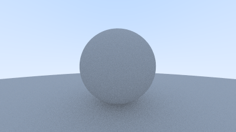

# Diffuse Materials

Now that we have objects and multiple rays per pixel, we can make some realistic looking materials. We’ll start with diffuse (matte) materials. One question is whether we mix and match geometry and materials (so we can assign a material to multiple spheres, or vice versa) or if geometry and material are tightly bound (that could be useful for procedural objects where the geometry and material are linked). We’ll go with separate — which is usual in most renderers — but do be aware of the limitation.

## A Simple Diffuse Material

Diffuse objects that don't emit light merely take on the color of their surroundings, but they modulate that with their own intrinsic color. Light that reflects off a diffuse surface has its direction randomized. So, if we send three rays into a crack between two diffuse surfaces they will each have different random behavior:


They also might be absorbed rather than reflected. The darker the surface, the more likely absorption is. (That’s why it is dark!) Really any algorithm that randomizes direction will produce surfaces that look matte. One of the simplest ways to do this turns out to be exactly correct for ideal diffuse surfaces. (I used to do it as a lazy hack that approximates mathematically ideal Lambertian.)

(Reader Vassillen Chizhov proved that the lazy hack is indeed just a lazy hack and is inaccurate. The correct representation of ideal Lambertian isn't much more work, and is presented at the end of the chapter.)

There are two unit radius spheres tangent to the hit point \\(p\\) of a surface. These two spheres have a center of \\((P+n)\\) and \\((P-n)\\), where \\(n\\) is the normal of the surface. The sphere with a center at \\((P-n)\\) is considered inside the surface, whereas the sphere with center \\((P+n)\\) is considered outside the surface. Select the tangent unit radius sphere that is on the same side of the surface as the ray origin. Pick a random point \\(S\\) inside this unit radius sphere and send a ray from the hit point 𝐏 to the random point \\(S\\) (this is the vector \\((S-P)\\):

We need a way to pick a random point in a unit radius sphere. We’ll use what is usually the easiest algorithm: a rejection method. First, pick a random point in the unit cube where x, y, and z all range from −1 to +1. Reject this point and try again if the point is outside the sphere.

```rust
impl Vec3{

    #[inline]
        pub fn random() -> Self {
            Vec3 {
                e: (random_double(), random_double(), random_double()),
            }
        }

        #[inline]
        pub fn random_rng(min: f64, max: f64) -> Self {
            Vec3 {
                e: (
                    random_double_rng(min, max),
                    random_double_rng(min, max),
                    random_double_rng(min, max),
                ),
            }
        }

        pub fn random_in_unit_sphere() -> Self {
            loop {
                let p = Vec3::random_rng(-1.0, 1.0);
                if p.length_squared() < 1f64 {
                    return p;
                }
            }
        }
}
```

Then update the `ray_color()` function to use the new radom direction generator:

```rust

fn ray_color(r: &Ray, world: &dyn Hittable) -> Color {
    if let Some(rec) = world.hit(r, 0f64, Infinity) {
        let target: Point3 = rec.p() + rec.normal() + Vec3::random_in_unit_sphere();
        return 0.5 * ray_color(&Ray::from(rec.p(), target - rec.p()), world);
    }
    let unit_direction: Vec3 = r.direction().unit_vector();
    let t = 0.5 * (unit_direction.y() + 1f64);
    (1f64 - t) * Color::from(1f64, 1f64, 1f64) + t * Color::from(0.5, 0.7, 1f64)
}
```

## Limiting the Number of Child Rays

There's one potential problem lurking here. Notice that the `ray_color` function is recursive. When will it stop recursing? When it fails to hit anything. In some cases, however, that may be a long time — long enough to blow the stack. To guard against that, let's limit the maximum recursion depth, returning no light contribution at the maximum depth:

```rust

fn main() {
    // Image
#    const ASPECT_RATIO: f64 = 16f64 / 9f64;
#    const IMAGE_WIDTH: i32 = 400;
#    const IMAGE_HEIGHT: i32 = (IMAGE_WIDTH as f64 / ASPECT_RATIO) as i32;
#    const SAMPLES_PER_PIXEL: i32 = 100;
    const MAX_DEPTH: i32 = 50;

#    // World
#    let mut world = HittableList::new();
#    world.add(Rc::new(Sphere::from(Point3::from(0f64, 0f64, -1f64), 0.5)));
#    world.add(Rc::new(Sphere::from(
#        Point3::from(0f64, -100.5f64, -1f64),
#        100f64,
#    )));
#
#    // Camera
#
#    let cam = Camera::new();
#
#    // Render
#
#    println!("P3\n{IMAGE_WIDTH} {IMAGE_HEIGHT}\n255");
#
    for j in (0..IMAGE_HEIGHT).rev() {
#        eprintln!("\rScanlines remaining: {j}");
        for i in 0..IMAGE_WIDTH {
#            let mut pixel_color: Color = Color::from(0.0, 0.0, 0.0);
            for s in 0..SAMPLES_PER_PIXEL {
#                let u = (i as f64 + random_double()) / (IMAGE_WIDTH - 1) as f64;
#                let v = (j as f64 + random_double()) / (IMAGE_HEIGHT - 1) as f64;
#                let r = cam.get_ray(u, v);
#
                pixel_color += ray_color(&r, &world, MAX_DEPTH);
            }
#            write_color(std::io::stdout(), pixel_color, SAMPLES_PER_PIXEL).unwrap();
        }
    }
#    eprintln!("\nDone");
}

fn ray_color(r: &Ray, world: &dyn Hittable, depth: i32) -> Color {
    if depth <= 0 {
        return Color::from(0.0, 0.0, 0.0);
    }

#    if let Some(rec) = world.hit(r, 0f64, Infinity) {
#        let target: Point3 = rec.p() + rec.normal() + Vec3::random_in_unit_sphere();
        return 0.5 * ray_color(&Ray::from(rec.p(), target - rec.p()), world, depth - 1);
        #    }
#    let unit_direction: Vec3 = r.direction().unit_vector();
#    let t = 0.5 * (unit_direction.y() + 1f64);
#    (1f64 - t) * Color::from(1f64, 1f64, 1f64) + t * Color::from(0.5, 0.7, 1f64)
}
```

This gives us:


Note: If you met up with some performance issue, try using the release mode: `cargo build --release`

## Using Gamma Correction for Accurate Color Intensity

Note the shadowing under the sphere. This picture is very dark, but our spheres only absorb half the energy on each bounce, so they are 50% reflectors. If you can’t see the shadow, don’t worry, we will fix that now. These spheres should look pretty light (in real life, a light grey). The reason for this is that almost all image viewers assume that the image is “gamma corrected”, meaning the 0 to 1 values have some transform before being stored as a byte. There are many good reasons for that, but for our purposes we just need to be aware of it. To a first approximation, we can use “gamma 2” which means raising the color to the power 1/𝑔𝑎𝑚𝑚𝑎, or in our simple case ½, which is just square-root:

```rust

pub fn write_color<T: std::io::Write>(
    mut fmt: T,
    pixel_color: Color,
    samples_per_pixel: i32,
) -> std::io::Result<()> {

// Divide the color by the number of samples and gamma-correct for gamma=2.0

let scale = 1.0 / samples_per_pixel as f64;

r = (scale * r).sqrt();
g = (scale * g).sqrt();
b = (scale * b).sqrt();
}

```

That yields light grey, as we desire:


## Fixing Shadow Acne

There’s also a subtle bug in there. Some of the reflected rays hit the object they are reflecting off of not at exactly \\(t=0\\), but instead at \\(t=−0.0000001\\) or \\(t=0.00000001\\) or whatever floating point approximation the sphere intersector gives us. So we need to ignore hits very near zero:

```rust
if let Some(rec) = world.hit(r, 0.0001f64, Infinity) {
    let target: Point3 = rec.p() + rec.normal() + Vec3::random_in_unit_sphere();
    return 0.5 * ray_color(&Ray::from(rec.p(), target - rec.p()), world, depth - 1);
}
```

This gets rid of the shadow acne problem. Yes it is really called that.

## True Lambertian Reflection

The rejection method presented here produces random points in the unit ball offset along the surface normal. This corresponds to picking directions on the hemisphere with high probability close to the normal, and a lower probability of scattering rays at grazing angles. This distribution scales by the \\(\cos^3(\phi)\\) where \\(\phi\\) is the angle from the normal. This is useful since light arriving at shallow angles spreads over a larger area, and thus has a lower contribution to the final color.

However, we are interested in a Lambertian distribution, which has a distribution of \\(\cos(\phi)\\). True Lambertian has the probability higher for ray scattering close to the normal, but the distribution is more uniform. This is achieved by picking random points on the surface of the unit sphere, offset along the surface normal. Picking random points on the unit sphere can be achieved by picking random points in the unit sphere, and then normalizing those.

```rust
impl Vec3 {
    pub fn random_unit_vector() -> Self {
            Vec3::unit_vector(&Vec3::random_in_unit_sphere())
        }
}

```

This `random_unit_vector()` is a drop-in replacement for the existing `random_in_unit_sphere()` funciton.

```rust

fn ray_color(r: &Ray, world: &dyn Hittable, depth: i32) -> Color {
#    if depth <= 0 {
#        return Color::from(0.0, 0.0, 0.0);
#    }
#
#    if let Some(rec) = world.hit(r, 0.0001f64, Infinity) {
        let target: Point3 = rec.p() + rec.normal() + Vec3::random_unit_vector();
#        return 0.5 * ray_color(&Ray::from(rec.p(), target - rec.p()), world, depth - 1);
#    }
#    let unit_direction: Vec3 = r.direction().unit_vector();
#    let t = 0.5 * (unit_direction.y() + 1f64);
#    (1f64 - t) * Color::from(1f64, 1f64, 1f64) + t * Color::from(0.5, 0.7, 1f64)
}
```

After rendering we get a similar image:


It's hard to tell the difference between these two diffuse methods, given that our scene of two spheres is so simple, but you should be able to notice two important visual differences:

- The shadows are less pronounced after the change
- Both spheres are lighter in appearance after the change

Both of these changes are due to the more uniform scattering of the light rays, fewer rays are scattering toward the normal. This means that for diffuse objects, they will appear lighter because more light bounces toward the camera. For the shadows, less light bounces straight-up, so the parts of the larger sphere directly underneath the smaller sphere are brighter.

## An Alternative Diffuse Formulation

The initial hack presented in this book lasted a long time before it was proven to be an incorrect approximation of ideal Lambertian diffuse. A big reason that the error persisted for so long is that it can be difficult to:

- Mathematically prove that the probability distribution is incorrect
- Intuitively explain why a \\(\cos(\phi)\\) distribution is desirable (and what it would look like)

Not a lot of common, everyday objects are perfectly diffuse, so our visual intuition of how these objects behave under light can be poorly formed.

In the interest of learning, we are including an intuitive and easy to understand diffuse method. For the two methods above we had a random vector, first of random length and then of unit length, offset from the hit point by the normal. It may not be immediately obvious why the vectors should be displaced by the normal.

A more intuitive approach is to have a uniform scatter direction for all angles away from the hit point, with no dependence on the angle from the normal. Many of the first raytracing papers used this diffuse method (before adopting Lambertian diffuse).

```rust
impl Vec3{

    pub fn random_in_hemisphere(normal: &Vec3) -> Self {
        let in_unit_sphere = Vec3::random_in_unit_sphere();
        if Vec3::dot(&in_unit_sphere, normal) > 0.0 {
            in_unit_sphere
        } else {
            -in_unit_sphere
        }
    }
}
```

Plugging the new formula into the `ray_color()` function:

```rust
fn ray_color(r: &Ray, world: &dyn Hittable, depth: i32) -> Color {
#    if depth <= 0 {
#        return Color::from(0.0, 0.0, 0.0);
#    }
#
#    if let Some(rec) = world.hit(r, 0.0001f64, Infinity) {
        let target: Point3 = rec.p() + Vec3::random_in_hemisphere(&rec.normal());
#        return 0.5 * ray_color(&Ray::from(rec.p(), target - rec.p()), world, depth - 1);
#    }
#    let unit_direction: Vec3 = r.direction().unit_vector();
#    let t = 0.5 * (unit_direction.y() + 1f64);
#    (1f64 - t) * Color::from(1f64, 1f64, 1f64) + t * Color::from(0.5, 0.7, 1f64)
}

```

Gives us the following image:


